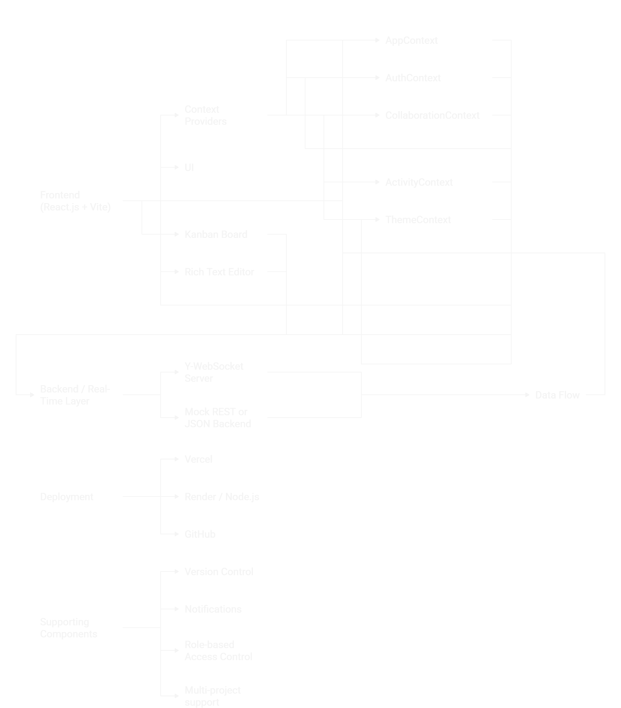

# 🧠 Project Documentation

## 📘 Project Overview
**Project Name:** ProjectFlow  
A collaborative project management platform with real-time document editing, team collaboration, and role-based permissions.

---

## 🏗️ System Architecture

Below is the high-level architecture of the system:

### Explanation
- **Frontend (Vercel):** React + Vite app for the user interface.
- **Backend (Render):** Y-WebSocket server handling real-time synchronization.
- **Contexts:** Modular React Context API for theme, authentication, collaboration, and activity tracking.
- **Database (Mock / Future Upgrade):** Currently mock data, planned for MongoDB integration.

---

## ⚙️ Key Modules
- **AppContext:** Manages global data like projects, users, and permissions.  
- **CollaborationContext:** Handles Yjs real-time collaboration.  
- **ActivityContext:** Tracks user actions and activity logs.  
- **ThemeContext:** Toggles between light and dark modes.

---

## 🚫 Current Limitations
1. **No persistent backend:** Collaboration data is not stored permanently.
2. **WebSocket runs locally:** Y-WebSocket server not yet hosted for production.
3. **Mock users only:** No real authentication or database integration yet.
4. **Version control is in-memory:** Page versions reset after refresh.
5. **Offline mode not supported.**

---

## 🚀 Future Improvements
- Deploy a backend API with database persistence.
- Add authentication (JWT / OAuth).
- Integrate role-based permissions and file uploads.
- Enable full synchronization across sessions.

---